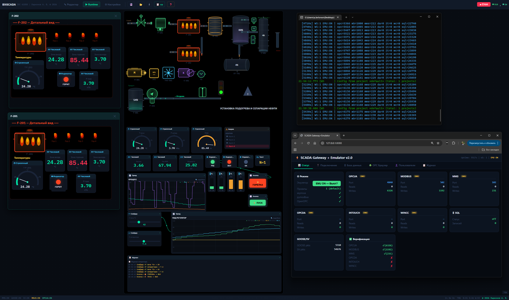
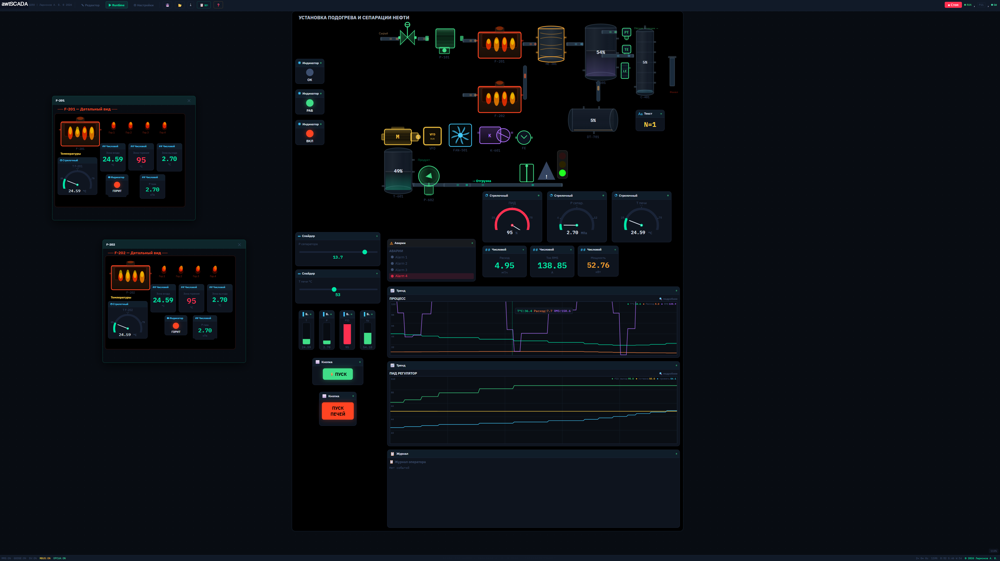
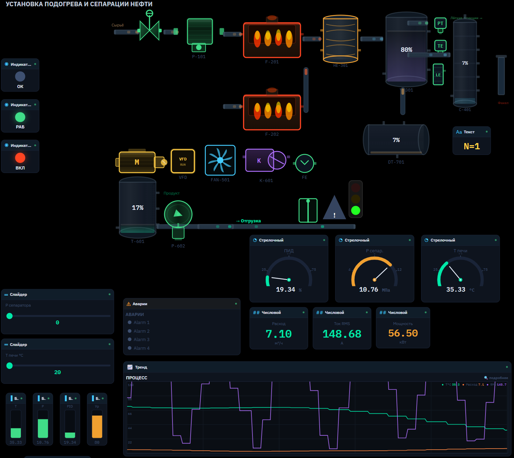
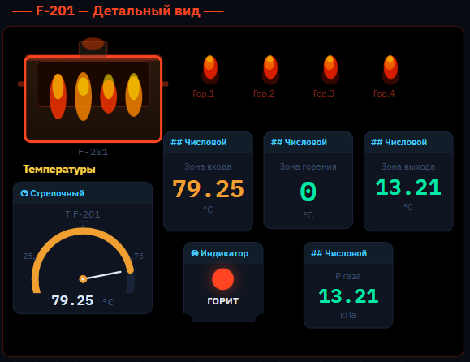
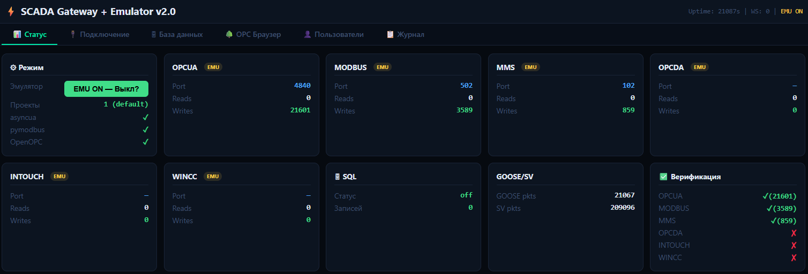
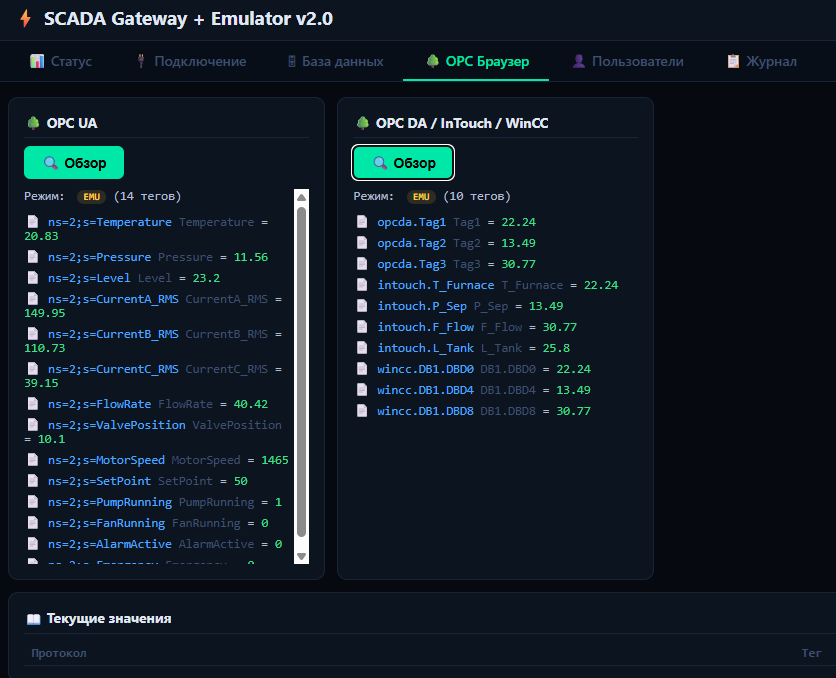
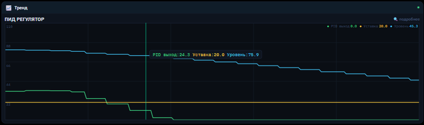

# BitSCADA IEC 61850 — Industrial SCADA in a Single HTML File

> **If you find this project useful, please give it a star!** It helps others discover BitSCADA.

[](https://github.com/larionovavi-stack/bitscada/stargazers)
[](https://larionovavi-stack.github.io/bitscada/)
[](https://github.com/larionovavi-stack/bitscada/releases/download/v1.0-en/BitSCADA_Demo_EN.zip)
[](https://avlarion.gumroad.com/l/mcmeyl)



## The only SCADA system in the world that runs from a single HTML file.

**BitSCADA** is a complete industrial SCADA/HMI system that runs entirely in a web browser. No installation, no server — just open the file and start working.

### Key Features

| Feature | Details |
|---------|---------|
| 🔌 **Industrial Protocols** | IEC 61850 (MMS, GOOSE, SV), OPC UA, OPC DA, Modbus TCP, MQTT, SNMP |
| ⚡ **Function Blocks** | 53 blocks: logic, math, timers, PID, filters, interlocks |
| 🎨 **Graphic Elements** | 65 elements: pumps, valves, motors, tanks, pipes, sensors, gauges |
| 📊 **Database** | Built-in SQLite: trends, alarms, operator log, CSV export |
| 🔒 **Zero Installation** | Any browser: Chrome, Firefox, Edge, Safari. Fully offline. |
| 🐍 **Python Gateway** | Real PLC/RTU/IED connection. REST API (15 endpoints). WebSocket. |
| 📱 **Cross-platform** | Windows, Linux, macOS — any device with a browser |
| 🏭 **IEC 61850** | Full MMS/GOOSE/SV stack — unique for browser-based SCADA |

### Specifications

```
Protocols:        9 industrial protocols
Function Blocks:  53
Graphic Elements: 65
Scan Rate:        10,000 tags/sec
Update Cycle:     100 ms minimum
REST API:         15 endpoints
Database:         SQLite (4 tables)
Parallel Threads: 4
Browser Tabs:     8
```

### Quick Start

1. [Download Demo](https://github.com/larionovavi-stack/bitscada/releases/download/v1.0-en/BitSCADA_Demo_EN.zip) (20 MB)
2. Extract and open `SCADA_IEC61850_v8.html` in your browser
3. Demo project loads automatically with built-in emulator
4. To connect real equipment — run `SCADA_Gateway` for your OS

### Screenshots

<details>
<summary>Click to view screenshots</summary>

#### System Overview


#### Runtime Mode


#### Mimic Diagram — Oil Treatment Unit


#### Instruments & Gauges


#### SCADA Gateway


#### OPC UA Browser


#### Trends


</details>

### Target Industries

- ⚡ Power generation & distribution (IEC 61850 digital substations)
- 🛢 Oil & gas (process control)
- 💧 Water treatment
- 🏭 Manufacturing automation
- 🏢 Building management systems

### Documentation

📖 [Full Documentation](https://larionovavi-stack.github.io/bitscada/docs/)

### Architecture

```
Browser (Chrome/Firefox/Edge/Safari)
    └── BitSCADA HTML file
            ├── Graphic Editor (drag & drop)
            ├── Runtime (fullscreen, alarms, trends)
            ├── Function Block Engine (53 blocks)
            └── WebSocket ←→ SCADA Gateway (Python)
                                ├── IEC 61850 (MMS, GOOSE, SV)
                                ├── OPC UA / OPC DA
                                ├── Modbus TCP
                                ├── MQTT / SNMP
                                └── SQLite Database
```

### Buy Full Source Code

**[$15,000 — Buy on Gumroad](https://avlarion.gumroad.com/l/mcmeyl)**

Includes: complete source code (JSX + Python), build system, English + Russian versions, demo project, production website. Delivered within 3 days after purchase.

---

**© 2026 ATW Technologies | [Website](https://larionovavi-stack.github.io/bitscada/) | [Contact](mailto:expert.asutp@gmail.com)**

### Tags

`SCADA` `HMI` `IEC-61850` `OPC-UA` `Modbus` `Industrial-Automation` `Python` `React` `PLC` `RTU` `Digital-Substation` `Process-Control`
